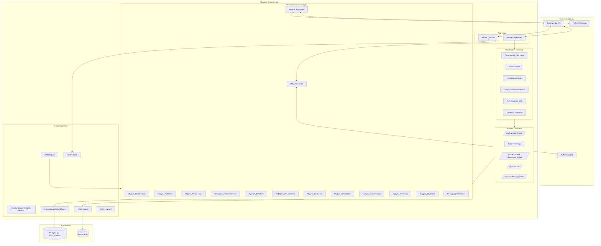
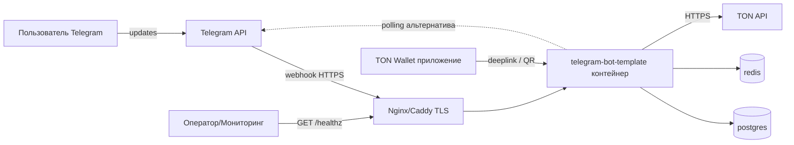
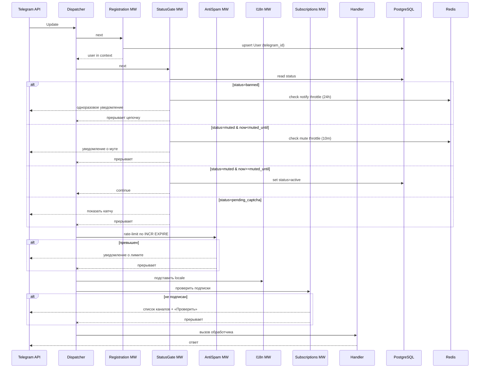

# Дизайн: Шаблонный Telegram-бот (telegram-bot-template)

## Обзор

Документ описывает техническую реализацию шаблонного Telegram-бота, покрывающую все 17 требований из `requirements.md`. Архитектура модульная: есть стабильное ядро (Core) и опциональные функциональные модули (Features), подключаемые через флаги в `Конфигурации`. Шаблон разворачивается поэтапно (этапы 1–7 из Приложения А требований): ядро → админка → TON Connect → UX-защита → рост → монетизация → эксплуатация. Код на каждом этапе остаётся рабочим без правок уже включённых модулей.

### Технологический стек

| Слой | Выбор | Обоснование |
|---|---|---|
| Язык | Python 3.11+ | async/await, зрелые SDK для Telegram и TON. |
| Бот-фреймворк | aiogram 3.x | Асинхронный, middleware, Router/Filter, встроенная поддержка FSM, активно поддерживается. |
| Веб-сервер | aiohttp 3.x | Уже зависимость aiogram, используется для вебхуков Telegram, health-check, TON Connect manifest и callback-эндпоинтов. |
| ORM | SQLAlchemy 2.x (async) + Alembic | Типобезопасный async-ORM, миграции через Alembic. |
| БД | PostgreSQL 15+ (прод), SQLite (dev) | Реляционная, идёт через один драйвер-абстрактный слой SQLAlchemy. |
| Кэш / FSM store / очередь | Redis 7+ (`redis.asyncio`) | Хранилище FSM, rate-limit счётчики антиспама, кэш прав, очередь рассылки, TON Connect sessions. |
| TON Connect | `pytonconnect` + собственный манифест | Официальный Python SDK для TON Connect 2. |
| TON API | `pytoniq-core` + TonCenter/TonAPI HTTP | Проверка on-chain транзакций TON-платежей. |
| Конфигурация | `pydantic-settings` (v2) | Типизированная загрузка из env/.env, fail-fast валидация. |
| i18n | `aiogram_i18n` + Fluent (`.ftl`) или YAML-каталоги | Интеграция с middleware aiogram, fallback на язык по умолчанию. |
| Планировщик | APScheduler (async) | Ежедневная очистка журнала, проверка истёкших мутов и TON-платежей, истекших TON Connect сессий. |
| Логирование | `structlog` + stdout JSON | Структурированные логи, корреляция с записями `Журнала_Действий`. |
| Упаковка/деплой | Docker + docker-compose, GitHub Actions | Один образ бот-процесса + Postgres + Redis. |

Стек — дефолт шаблона, не требование. Любой слой заменяется без переписывания ядра, кроме бот-фреймворка (aiogram-специфичные middleware/Router).

## Архитектура

### Слои



### Развёртывание



Два режима получения апдейтов:
- Long polling (этап 1, dev): ничего кроме исходящего интернета не нужно, `getUpdates` в цикле.
- Webhook (прод): требуется HTTPS-эндпоинт `/tg/webhook/<secret>`, Telegram шлёт POST. Выбор режима — в Конфигурации (`TG_MODE=polling|webhook`).

### Модель процессов

Один процесс-бот содержит:
- `aiogram.Dispatcher` — обработчик апдейтов (корутины).
- `aiohttp.web.Application` — вебхуки Telegram + `/healthz` + `/tonconnect-manifest.json` + `/tonconnect/callback`.
- `APScheduler AsyncIOScheduler` — cron-задачи:
  - ежедневно 03:00 — чистка Журнала_Действий старше 90 дней;
  - каждую минуту — опрос подтверждения TON-платежей со статусом `pending`;
  - каждую минуту — пометка истёкших TON Connect сессий.
- `BroadcastWorker` — фоновая asyncio task, читающая Redis-очередь рассылок.

Все I/O — неблокирующие. Graceful shutdown: закрытие webhook, дренирование очередей, закрытие пулов БД/Redis.

## Структура проекта

```
telegram-bot-template/
├── app/
│   ├── __main__.py                 # точка входа: loads config → builds bot → runs
│   ├── bot.py                      # фабрика Bot/Dispatcher/Router
│   ├── web.py                      # aiohttp-приложение (webhook, health, tonconnect)
│   ├── config.py                   # pydantic-settings, флаги модулей
│   ├── container.py                # DI-контейнер (простой NamedTuple со всеми сервисами)
│   │
│   ├── core/                       # всегда включено
│   │   ├── db/
│   │   │   ├── engine.py
│   │   │   ├── base.py             # DeclarativeBase
│   │   │   └── models.py           # User, Role, ActionLog, Payment, Broadcast, Referral
│   │   ├── repositories/
│   │   │   ├── users.py
│   │   │   ├── roles.py
│   │   │   ├── audit.py
│   │   │   └── ...
│   │   ├── cache/
│   │   │   └── redis_client.py
│   │   ├── middlewares/
│   │   │   ├── registration.py     # Модуль_Регистрации
│   │   │   ├── status_gate.py      # ban/mute/captcha gate
│   │   │   ├── audit_context.py    # инжект trace_id
│   │   │   └── i18n.py             # условное включение
│   │   ├── handlers/
│   │   │   ├── start.py
│   │   │   ├── profile.py          # Модуль_Профиля
│   │   │   └── cancel.py
│   │   ├── services/
│   │   │   ├── audit.py            # Журнал_Действий
│   │   │   ├── registration.py     # Модуль_Регистрации
│   │   │   ├── profile.py
│   │   │   ├── fsm.py              # Менеджер_Состояний wrapper
│   │   │   └── retry.py            # retry/backoff helper
│   │   ├── utils/
│   │   │   └── clock.py            # инжектируемое now() для тестов
│   │   └── healthcheck.py
│   │
│   ├── admin/                      # этап 2 — Админ_Панель
│   │   ├── authorization.py        # Модуль_Авторизации
│   │   ├── user_manager.py         # Менеджер_Пользователей (ban/mute/kick/unban)
│   │   ├── handlers.py
│   │   └── filters.py              # IsAdminFilter / IsSuperadminFilter
│   │
│   ├── ton/                        # этап 3 — TON_Коннектор
│   │   ├── connector.py            # pytonconnect wrapper
│   │   ├── session_store.py        # Redis storage для TON Connect сессий
│   │   ├── verifier.py             # проверка proof подписи
│   │   ├── handlers.py             # /connect_wallet, /disconnect_wallet
│   │   └── manifest.py             # отдача tonconnect-manifest.json
│   │
│   ├── features/                   # этапы 4–6 (опциональные)
│   │   ├── i18n/                   # Модуль_Локализации
│   │   ├── antispam/               # Модуль_Антиспам
│   │   ├── subscriptions/          # Модуль_Подписок
│   │   ├── referrals/              # Реферальная_Система
│   │   ├── broadcasts/             # Модуль_Рассылки
│   │   ├── stats/                  # Модуль_Статистики
│   │   └── payments/               # Модуль_Платежей (Stars + TON)
│   │
│   ├── scheduler/
│   │   └── jobs.py                 # чистка журнала, TON-опросы, истёкшие сессии
│   │
│   └── locales/
│       ├── ru.yml
│       └── en.yml
│
├── migrations/                     # Alembic
├── tests/
├── tonconnect-manifest.json.example
├── .env.example
├── docker-compose.yml
├── Dockerfile
├── pyproject.toml
└── README.md
```

## Поток регистрации и middleware

Порядок middleware в `Dispatcher` (сверху вниз = раньше):



Порядок критичен: регистрация — первой (все остальные middleware и обработчики читают `user`), статусные проверки — до бизнес-логики, антиспам — до i18n чтобы не тратить ресурсы.

## Компоненты и интерфейсы

Все публичные интерфейсы ниже — `Protocol`/ABC на Python. Конкретные реализации инжектируются через контейнер `AppServices`. Это даёт возможность подменять компоненты (например, `InMemoryCache` в тестах вместо Redis).

### Core

#### Конфигурация (`app/config.py`)

```python
class Settings(BaseSettings):
    # Обязательные — fail-fast при отсутствии (Требование 15.3)
    bot_token: SecretStr
    db_dsn: PostgresDsn
    redis_url: RedisDsn

    # Режим
    tg_mode: Literal["polling", "webhook"] = "polling"
    webhook_public_url: HttpUrl | None = None
    webhook_secret: SecretStr | None = None
    http_host: str = "0.0.0.0"
    http_port: int = 8080

    # Начальные суперадмины (Требование 4.4)
    superadmin_ids: list[int] = []

    # Флаги модулей (Требование 15.1) — все выключены по умолчанию
    feature_ton_connector: bool = False
    feature_referrals: bool = False
    feature_broadcasts: bool = False
    feature_stats: bool = False
    feature_i18n: bool = False
    feature_antispam: bool = False
    feature_subscriptions: bool = False
    feature_payments: bool = False

    # Параметры модулей — требуются только при включённом флаге
    default_locale: str = "ru"
    supported_locales: list[str] = ["ru", "en"]
    required_channels: list[str] = []             # @username каналов
    ton_manifest_url: HttpUrl | None = None
    ton_receive_address: str | None = None
    payments_provider: Literal["stars", "ton", "both"] | None = None
    fsm_timeout_minutes: int = 30
```

Валидация в `model_validator`: если `feature_ton_connector=True` — обязательны `ton_manifest_url` и `webhook_public_url` (Требование 16.4). Если `tg_mode=webhook` — обязательны `webhook_public_url` и `webhook_secret`.

#### База_Данных — репозитории

```python
class UsersRepo(Protocol):
    async def get_by_tg_id(self, telegram_id: int) -> User | None
    async def upsert_from_tg(self, tg_user: TgUser, *, now: datetime) -> User
    async def update_last_seen(self, telegram_id: int, now: datetime) -> None
    async def set_status(self, telegram_id: int, status: UserStatus,
                         *, banned_by: int | None = None,
                         ban_reason: str | None = None,
                         muted_until: datetime | None = None) -> None
    async def set_wallet(self, telegram_id: int, address: str,
                         wallet_name: str, now: datetime) -> None
    async def clear_wallet(self, telegram_id: int) -> None
    async def set_referrer(self, telegram_id: int, referrer_id: int) -> None
    async def increment_referrals(self, referrer_id: int, now: datetime) -> None
    async def mark_blocked_bot(self, telegram_id: int) -> None
    async def count_active_since(self, since: datetime) -> int
    async def iterate_for_broadcast(self, filter: BroadcastFilter) -> AsyncIterator[int]
```

Реализация — SQLAlchemy async, транзакции через `async with session.begin()`. Идемпотентные операции (`upsert_from_tg`) — через `INSERT ... ON CONFLICT DO UPDATE`.

#### Retry / backoff (`core/services/retry.py`)

Единый helper, используемый везде, где требуется ретрай Telegram/БД (Требования 1.4, 6.6, 17.1):

```python
async def with_retry(fn: Callable[[], Awaitable[T]], *,
                     attempts: int = 3,
                     delays: Sequence[float] = (1, 2, 4),
                     retry_on: tuple[type[Exception], ...]) -> T
```

Для Telegram — ловит `TelegramNetworkError`, `TelegramServerError`, HTTP 5xx. Для БД — `OperationalError`, `DBAPIError` с кодами недоступности. `RetryAfter` от Telegram обрабатывается отдельно (ждём указанное API время).

#### Журнал_Действий (`core/services/audit.py`)

```python
class AuditLog(Protocol):
    async def record_moderation(self, *, actor_id: int, target_id: int,
                                action: ModerationAction, reason: str,
                                now: datetime) -> None
    async def record_error(self, *, source: ErrorSource, message: str,
                           now: datetime, trace_id: str | None = None) -> None
    async def record_warning(self, *, actor_id: int | None, event: str,
                             details: dict, now: datetime) -> None
    async def record_info(self, *, event: str, details: dict, now: datetime) -> None
    async def list_page(self, *, page: int, page_size: int = 50) -> AuditPage
```

Ретрай записи — 3 попытки с интервалом 1с. При исчерпании — уведомление суперадмину через Telegram (отдельный bot-сервис с приоритетом), и запись в fallback-лог (stdout JSON) с тегом `audit_drop`. Это не блокирует исходное действие модерации (Требование 6.6).

Авто-очистка: APScheduler job `audit_cleanup` раз в сутки выполняет `DELETE FROM action_log WHERE created_at < now() - interval '90 days'` и пишет запись уровня `info` с количеством удалённых строк (Требование 6.4).

Поле `reason` ограничено 500 символов в БД через `String(500)` + проверка на уровне сервиса. Поле `message` ошибок — 1000 символов, более длинные усекаются и помечаются суффиксом `... [truncated]` (Требование 6.2).

#### Модуль_Регистрации (middleware `core/middlewares/registration.py`)

Выполняется перед всеми остальными middleware. Для `Message`/`CallbackQuery` выполняет `UsersRepo.upsert_from_tg`:

1. Если записи нет — вставить со всеми полями из Telegram User, `status=active`, `created_at=now`.
2. Если есть — обновить `last_seen_at=now`; для `username/first_name/last_name/language_code` — обновить ТОЛЬКО изменённые поля.

Специальная обработка `/start` с параметром `ref_<id>`: извлекается из `Message.text`, передаётся в `Модуль_Регистрации`, который проверяет (Требование 1.7/1.8): пользователь ещё не зарегистрирован И `telegram_id_referrer != telegram_id_user` И пригласивший существует. Только тогда `referrer_id` сохраняется, и у пригласившего `referrals_count += 1`, `last_referral_at = now` (для совместимости с Требованием 7.2 и 7.4). Всё в одной транзакции.

Ретрай upsert'а — через общий `with_retry` (Требование 1.4). При окончательном отказе — ответ пользователю, запись в `audit.record_error` (Требование 1.5).

#### Модуль_Профиля (`core/handlers/profile.py`)

Handler на `/profile`:
1. Если `user.status == banned` — ответить локализованным сообщением блокировки, не раскрывая данные (Требование 2.4).
2. Иначе отрендерить профиль: `telegram_id`, `display_name` (склейка first_name + last_name, иначе username, иначе `ID:<telegram_id>`), `language_code`, `created_at`, `status`, при `feature_ton_connector` — `ton_address`, при `feature_referrals` — `referrals_count` (Требование 2.1).
3. Inline-клавиатура: «Сменить язык» (только если `feature_i18n`), «Отвязать кошелёк» (только если есть `ton_address`).

CallbackQuery-хендлеры: смена языка (валидировать что в `supported_locales`, запись в `users.language_code`), отвязка кошелька (делегируется `TON_Коннектор.disconnect()`).

Возвращает только данные контекстного пользователя (Требование 2.5) — нет команды «посмотреть чужой профиль» в пользовательском Router'е (это отдельная админ-команда).

#### Менеджер_Состояний (FSM)

aiogram 3 из коробки имеет `BaseStorage`. Используем `RedisStorage` с ключом `fsm:{bot_id}:{chat_id}:{user_id}` и TTL = `fsm_timeout_minutes * 60` (Требование 14.3). При `/cancel` вызывается `state.clear()` (Требование 14.2).

Дополнительно в `core/services/fsm.py` — тонкая обёртка с health-probe Redis: перед каждым обновлением состояния пингуем Redis с таймаутом 300 мс. Если Redis недоступен — ловим `RedisError`, отвечаем пользователю локализованным «Диалоги временно недоступны», пишем `audit.record_error(source=Redis)` (Требование 14.4). Обработчики команд вне FSM работают (не все сценарии требуют FSM).

### Админ_Панель (этап 2)

#### Модуль_Авторизации (`app/admin/authorization.py`)

```python
class Authorization:
    async def get_role(self, telegram_id: int) -> Role | None:
        # 1) попытка из Redis ключа auth:role:<id>, TTL=60s
        # 2) если miss → из БД users_roles join
        # 3) если в БД нет, но id в settings.superadmin_ids → seed в БД как superadmin
    async def require_admin(self, telegram_id: int) -> Role  # raises NotAdmin
    async def require_superadmin(self, telegram_id: int) -> Role  # raises NotSuperadmin
    async def invalidate(self, telegram_id: int) -> None  # удаляет auth:role:<id>
```

Кэш ролей: Redis, TTL 60 секунд, инвалидация при изменении роли через `invalidate()` (Требование 4.7; 5 секунд запаса — TTL 60с покрывает с запасом, а `invalidate` делает это мгновенно).

Seed `superadmin_ids` из env: при старте бот сверяет, есть ли они в таблице ролей; если нет — вставляет с ролью `superadmin`. Никакие команды бота не могут назначить `superadmin` — только env (Требование 4.4).

Кастомные aiogram фильтры:
```python
class IsAdminFilter(Filter):
    async def __call__(self, event, auth: Authorization) -> bool:
        role = await auth.get_role(event.from_user.id)
        return role in (Role.admin, Role.superadmin)
```

Все админ-handlers регистрируются в отдельном `Router` с этим фильтром на Router-уровне. Если фильтр не проходит — apex dispatcher не найдёт совпадений, и пользователь получит тот же ответ что на любую неизвестную команду. Это и есть «одинаковое сообщение "Команда не найдена"» (Требование 4.3). Параллельно логируется `audit.record_warning(event="admin_cmd_unauthorized", actor_id, cmd_text)`.

#### Менеджер_Пользователей (`app/admin/user_manager.py`)

Команды с аргументами (принимают `telegram_id` цели как первый аргумент, причину/длительность — следующие):

```
/ban <telegram_id> <reason>
/unban <telegram_id>
/mute <telegram_id> <duration> [reason]   # duration: 10m, 2h, 1d, ...
/unmute <telegram_id>
/kick <telegram_id>                        # в групповом чате
/grant_admin <telegram_id>                 # только superadmin
/revoke_admin <telegram_id>                # только superadmin
```

Логика для каждой операции:
1. `Authorization.require_admin(actor_id)` (для grant/revoke — `require_superadmin`).
2. Найти `target = users.get_by_tg_id`. Если нет → «Пользователь не найден» (Требование 5.9).
3. Проверить, что `target.role not in (admin, superadmin)` или allow-операцию (size check Требование 5.8 / 4.6).
4. Валидация аргументов: длина `reason` 1–500 символов; длительность мута 1 минута … 30 дней.
5. Обновить БД в транзакции:
   - ban: `status=banned, banned_at=now, banned_by=actor, ban_reason=reason`.
   - unban: `status=active, banned_at=NULL, banned_by=NULL, ban_reason=NULL`.
   - mute: `status=muted, muted_until=now+duration, muted_by=actor`.
   - unmute: `status=active, muted_until=NULL, muted_by=NULL`.
   - kick: вызвать `bot.ban_chat_member(chat_id, telegram_id)` затем `unban_chat_member(only_if_banned=false)` — это «kick without ban»; таймаут 10с; если нет прав — `TelegramForbiddenError` → вернуть админу «Бот без прав администратора в чате».
6. `audit.record_moderation(...)`.
7. Для ban/grant/revoke: `auth.invalidate(target_id)`.
8. Ответ админу локализованным подтверждением.

Автоматическое снятие мута (Требование 5.5) — не через планировщик, а лениво в `StatusGate` middleware: если `status=muted` И `now >= muted_until` — выставить `active` в той же транзакции что проверка, и пропустить апдейт дальше.

Throttling уведомлений (Требования 5.2 и 5.4):
- Ban-уведомление: Redis-ключ `notify:ban:<id>`, TTL 24h, `SET NX`. Только при успешном SET отправляем сообщение.
- Mute-уведомление: `notify:mute:<id>`, TTL 600s.

### TON_Коннектор (этап 3)

#### Конструкция

TON Connect 2 требует:
1. Манифест по публичному HTTPS URL — JSON-файл, описывающий бот (name, url, iconUrl, termsOfUseUrl). Отдаётся aiohttp-обработчиком `/tonconnect-manifest.json` (Требование 16 — публичный URL нужен только на этапе 3).
2. Хранилище сессий — custom `IStorage` поверх Redis (`tc:session:<telegram_id>`) для записи пар ключ-значение библиотекой `pytonconnect`.

#### API

```python
class TonConnector:
    async def start_connection(self, telegram_id: int,
                               *, universal_link_expire_s: int = 600) -> StartResult:
        """
        Возвращает:
        - deeplink (tc://...)
        - QR-код (base64 PNG)
        - expires_at
        Создаёт новую сессию в Redis (ttl 600s = Требование 3.5).
        Отвечает ≤ 5 секунд (Требование 3.1).
        """

    async def await_connection(self, telegram_id: int) -> ConnectionResult:
        """
        Ожидает событие подключения через pytonconnect pending callback.
        При approve:
        - извлекает proof (signature + payload);
        - проверяет подпись публичным ключом кошелька;
        - проверяет что payload содержит актуальный nonce/timestamp, связанный с этим telegram_id;
        - если ок — сохраняет ton_address/wallet_name/connected_at в БД;
        - если не ок — пишет audit.error, возвращает Failure.
        """

    async def disconnect(self, telegram_id: int) -> bool:
        """
        Закрывает pytonconnect-сессию, чистит Redis-ключ, чистит
        ton_address/ton_wallet_name/ton_connected_at в БД.
        """
```

#### Proof payload

Payload для `TonProof` собирается как `tg:<telegram_id>:<issued_at>:<random_nonce>`, подписывается кошельком. На стороне бота:
1. Разобрать payload, проверить что `telegram_id` совпадает с текущим пользователем.
2. Проверить что `issued_at` в диапазоне [now-10min, now+1min].
3. Проверить nonce есть в Redis `tc:nonce:<telegram_id>` и уничтожить его (one-time).
4. Верифицировать ed25519 подпись публичным ключом из ответа кошелька.
5. Вычислить user-friendly адрес из `walletStateInit` (bounceable/raw), сохранить.

Если что-либо из 1–4 не прошло — отклонить (Требование 3.3).

#### Один активный кошелёк

Перед `start_connection` для пользователя с уже привязанным `ton_address`:
- Либо сообщить «У вас уже привязан кошелёк» и предложить `/disconnect_wallet` (Требование 3.6, безопасный путь).
- Автоматическая перепривязка НЕ делается — это защита от подмены.

#### Истечение сессий

APScheduler job `tc_session_cleanup` раз в минуту сканирует Redis `tc:session:*` с истекшим бизнес-TTL (хранится в сессии), закрывает их через `pytonconnect.disconnect` и удаляет ключ (Требование 3.5). Telegram-сообщение с ссылкой на сессию при истечении редактируется в «Сессия истекла, запустите /connect_wallet заново».

### Feature-модули

#### Реферальная_Система (`features/referrals`)

- `/ref`: собирает URL `https://t.me/{bot_username}?start=ref_{user_tg_id}` и возвращает пользователю. `bot_username` получается при старте через `bot.me()` и кэшируется. Ответ ≤ 3с (Требование 7, обновлено в деталях).
- `/referrals`: возвращает `referrals_count` и `last_referral_at` форматированно.
- Инкремент счётчика — в `Модуль_Регистрации` в момент первичной регистрации по ссылке (см. выше).

#### Модуль_Рассылки (`features/broadcasts`)

Архитектура — producer/consumer:
- Producer (команда `/broadcast`): FSM-диалог собирает текст (1..4096 символов, проверяется на уровне aiogram), фильтр, optional reply-markup → кладёт `BroadcastJob` в Redis LIST `bcast:queue`. Максимум 10 задач в очереди; при переполнении — отказать админу с объяснением.
- Consumer (`BroadcastWorker`, один на процесс): цикл `BRPOP` из `bcast:queue`. Для каждой задачи:
  - Создаёт запись `Broadcast(id, created_by, status=running, filter, text, total, delivered, failed, blocked, started_at)` в БД.
  - Через курсор `users.iterate_for_broadcast(filter)` получает `telegram_id` батчами.
  - Семафор на 30 req/s (Требование 8.2) — token-bucket 30 tokens в секунду с учётом `RetryAfter`.
  - На каждый `send_message` через `with_retry(...)`:
    - `TelegramForbiddenError` (403) → `users.mark_blocked_bot(telegram_id)`, counter++`blocked`, продолжать (Требование 8.3).
    - `TelegramRetryAfter` → sleep(retry_after), повторить ту же итерацию, не засчитывать как неуспех.
    - Прочее → counter++`failed`, `audit.record_error(source=Telegram API, message=repr(err))`.
  - Поддержка отмены: перед каждой отправкой проверять Redis-флаг `bcast:cancel:<job_id>`. При наличии — выйти из цикла, выставить `status=cancelled`, отправить инициатору промежуточный отчёт в течение 5 секунд (Требование 8.6).
  - По завершении — `status=completed`, отправить отчёт (всего / доставлено / не доставлено / заблокировали) (Требование 8.4).

Фильтры: `all`, `active_30d` (last_seen_at >= now-30d), `lang:<code>`. Дополнительный встроенный фильтр `not_blocked` применяется всегда (исключает `is_blocked_bot=true`).

#### Модуль_Статистики (`features/stats`)

Один запрос `/stats` выполняет агрегации в одной транзакции READ ONLY:
- `total_users`: `SELECT count(*) FROM users`.
- `active_24h/7d/30d`: `count(*) WHERE last_seen_at >= :since`.
- `banned`: `count(*) WHERE status = 'banned'`.
- `wallets`: `count(*) WHERE ton_address IS NOT NULL`.
- Регистрации по дням за период: `SELECT date_trunc('day', created_at) d, count(*) FROM users WHERE created_at BETWEEN :from AND :to GROUP BY d ORDER BY d`.

Время ответа: индексы по `last_seen_at`, `status`, `created_at` обеспечивают O(logN) для условий и O(N) только для тех, кто попал в период. Для каталога до ~1М пользователей ответ < 3с на среднем железе.

#### Модуль_Локализации (`features/i18n`)

- Два языковых файла: `locales/ru.yml`, `locales/en.yml`; ключ → перевод.
- Middleware `I18nMiddleware` (из `aiogram_i18n` или своя минимальная реализация) вычитывает `user.language_code` и кладёт функцию `_("key")` в data handler'а.
- Выбор языка: см. Требование 10 — нормализация `language_code` по первичному subtag (`en-US` → `en`).
- Fallback: если ключа нет в выбранном языке → вернуть из `default_locale`. Если нет и там → вернуть ключ + `audit.record_warning(event="missing_translation")`.

Старт: загрузка файлов с валидацией. Если файл `default_locale` повреждён — завершить запуск (Требование 15.3).

#### Модуль_Антиспам (`features/antispam`)

- Капча: простая математическая капча (числовая, 4 варианта ответа) через InlineKeyboard. При первом сообщении нового пользователя (если `feature_antispam=True`) middleware:
  - Если `status=pending_captcha` и капча не просрочена — показать/напомнить.
  - Если у пользователя в Redis есть `captcha:challenge:<id>` — ожидать ответ; таймаут 60с → `status=pending_captcha` и повтор.
  - После 3-х неудачных ответов подряд — `ban` на 300с через `notify:captcha_blocked:<id>` + запись warning в audit.
- Rate-limit: Redis INCR `rl:<telegram_id>` с `EXPIRE 3` (sliding window через `ZADD`+`ZREMRANGEBYSCORE` для точности). Если count > 5 → set `rl:block:<id>` TTL=30 s; WHILE этот ключ есть — игнорировать сообщения и отвечать «Слишком много сообщений».

#### Модуль_Подписок (`features/subscriptions`)

- Middleware проверяет подписки перед хендлерами, кроме `/start` и `/help`.
- Для каждого канала из `required_channels`:
  - Redis-кэш положительного результата `subs:ok:<user>:<channel>` TTL 300с. Hit → считаем подписанным.
  - Иначе `bot.get_chat_member(chat_id=channel, user_id)` с таймаутом 5с.
  - Если `status in ('member','administrator','creator')` — кэшируем и идём дальше.
  - Если `left/kicked/restricted` — собираем в список «нужно подписаться».
  - Если `TelegramForbiddenError/TelegramBadRequest` (нет прав у бота) — `audit.record_error(source=Telegram API, message="no rights in <channel>")`, пропускаем ЭТОТ канал (Требование 12.4).
  - Если таймаут — аналогично пропускаем.
- Если список «нужно подписаться» не пуст — сохранить исходную команду и её параметры в FSM-контексте как `pending_cmd`, отправить InlineKeyboard со ссылками на каналы и кнопкой «Проверить подписку».
- CallbackQuery «Проверить подписку» — повторить проверку. Если ок — извлечь `pending_cmd` из FSM и продиспатчить его.

#### Модуль_Платежей (`features/payments`)

Два подмодуля с общим репозиторием `PaymentsRepo`.

Stars:
- `create_stars_invoice(amount, payload) → link`: `bot.create_invoice_link` с `currency="XTR"`, `provider_token=""`, `prices=[LabeledPrice(amount=amount*100, ...)]`, `payload=charge_id`.
- Handler `successful_payment` обрабатывает событие: идемпотентно (через unique index на `telegram_payment_charge_id`). Сохраняет `Payment(status=paid)`, вызывает хук.

TON:
- `create_ton_payment(user, amount, purpose)`: через `TON_Коннектор` отправляет запрос `sendTransaction` на привязанный кошелёк пользователя, получает BOC. Сохраняет `Payment(status=pending, expected_amount, to_address=settings.ton_receive_address, payload_id)`.
- APScheduler job `ton_payments_poll` каждую минуту выбирает `Payment` где `status=pending` и `created_at > now-15min`:
  - Через TonCenter/TonAPI запрашивает входящие транзакции на `ton_receive_address`, фильтрует по payload.
  - Если найдена — сверить `amount == expected_amount` с точностью до 1 нанотон:
    - Совпадает → `status=paid, tx_hash=..., paid_at=now`, вызвать хук.
    - Не совпадает → `status=mismatch`, уведомить пользователя (Требование 13 в расширенном виде).
  - Если не найдена и `created_at <= now-15min` → `status=expired`, уведомить пользователя, прекратить опрос (Требование 13.4).

Идемпотентность (Требование 13.5): unique index на `(provider, tx_hash_or_charge_id)`; при конфликте — ничего не делать, хук не вызывается повторно.

### Инфраструктура

#### Health-check (`core/healthcheck.py`)

Эндпоинт `GET /healthz`:
```python
async def healthz(request):
    timeout = 1.0  # секунда на компонент (Требование 17.4)
    results = await asyncio.gather(
        asyncio.wait_for(db_ping(), timeout=timeout),
        asyncio.wait_for(redis_ping(), timeout=timeout),
        return_exceptions=True,
    )
    body = {
        "db": "available" if results[0] is True else "unavailable",
        "cache": "available" if results[1] is True else "unavailable",
    }
    status = 200 if all(v == "available" for v in body.values()) else 503
    return web.json_response(body, status=status)
```

Общий бюджет ответа — 2с (Требование 17.3), достигается параллельностью проверок.

#### Логирование версий (Требование 17.5)

На старте, до `bot.start_polling` или `webhook_handler.setup`:
```python
log.info("startup.versions",
    aiogram=aiogram.__version__,
    sqlalchemy=sqlalchemy.__version__,
    redis=redis.__version__,
    pytonconnect=pytonconnect.__version__ if settings.feature_ton_connector else None,
)
await audit.record_info(event="startup", details={...}, now=now())
```

#### Graceful shutdown

Хендлер `SIGTERM`/`SIGINT`:
1. Снять webhook (если включён) или остановить polling.
2. Дождаться завершения текущих handler-корутин (с таймаутом 10с).
3. Остановить APScheduler (`wait=True`).
4. Остановить BroadcastWorker (flag + close queue).
5. Закрыть pool БД и Redis.

## Модели данных

### Схема PostgreSQL

```sql
-- Пользователи
CREATE TYPE user_status AS ENUM ('active','banned','muted','pending_captcha');
CREATE TYPE user_role  AS ENUM ('user','admin','superadmin');

CREATE TABLE users (
  telegram_id     BIGINT PRIMARY KEY,
  username        VARCHAR(32),
  first_name      VARCHAR(64),
  last_name       VARCHAR(64),
  language_code   VARCHAR(8),
  status          user_status NOT NULL DEFAULT 'active',
  role            user_role   NOT NULL DEFAULT 'user',
  created_at      TIMESTAMPTZ NOT NULL DEFAULT now(),
  last_seen_at    TIMESTAMPTZ,
  -- Модерация
  banned_at       TIMESTAMPTZ,
  banned_by       BIGINT REFERENCES users(telegram_id),
  ban_reason      VARCHAR(500),
  muted_until     TIMESTAMPTZ,
  muted_by        BIGINT REFERENCES users(telegram_id),
  -- Рефералы
  referrer_id     BIGINT REFERENCES users(telegram_id),
  referrals_count INTEGER NOT NULL DEFAULT 0,
  last_referral_at TIMESTAMPTZ,
  -- TON
  ton_address      VARCHAR(68),
  ton_wallet_name  VARCHAR(64),
  ton_connected_at TIMESTAMPTZ,
  -- Рассылки
  is_blocked_bot   BOOLEAN NOT NULL DEFAULT false
);
CREATE INDEX ix_users_last_seen_at ON users(last_seen_at);
CREATE INDEX ix_users_status       ON users(status);
CREATE INDEX ix_users_created_at   ON users(created_at);
CREATE INDEX ix_users_role         ON users(role) WHERE role <> 'user';
CREATE UNIQUE INDEX ux_users_ton_address ON users(ton_address) WHERE ton_address IS NOT NULL;

-- Журнал действий
CREATE TYPE audit_level AS ENUM ('info','warning','error');

CREATE TABLE action_log (
  id           BIGSERIAL PRIMARY KEY,
  created_at   TIMESTAMPTZ NOT NULL DEFAULT now(),
  level        audit_level NOT NULL,
  actor_id     BIGINT,
  target_id    BIGINT,
  action       VARCHAR(32),        -- 'ban','mute','kick','unban','grant_admin',...
  source       VARCHAR(32),        -- 'Database','TON Connect','Telegram API', NULL
  reason       VARCHAR(500),
  message      VARCHAR(1000),
  trace_id     UUID
);
CREATE INDEX ix_action_log_created_at ON action_log(created_at DESC);
CREATE INDEX ix_action_log_level      ON action_log(level);
CREATE INDEX ix_action_log_actor      ON action_log(actor_id);
CREATE INDEX ix_action_log_target     ON action_log(target_id);

-- Платежи
CREATE TYPE payment_status   AS ENUM ('pending','paid','expired','mismatch','failed');
CREATE TYPE payment_provider AS ENUM ('stars','ton');

CREATE TABLE payments (
  id                    BIGSERIAL PRIMARY KEY,
  user_id               BIGINT NOT NULL REFERENCES users(telegram_id),
  provider              payment_provider NOT NULL,
  status                payment_status   NOT NULL DEFAULT 'pending',
  amount                BIGINT NOT NULL,          -- Stars: XTR*100; TON: нанотоны
  currency              VARCHAR(8) NOT NULL,
  purpose               VARCHAR(64),
  tx_hash_or_charge_id  VARCHAR(128),
  payload_id            UUID UNIQUE NOT NULL,     -- бизнес-payload, для корреляции
  created_at            TIMESTAMPTZ NOT NULL DEFAULT now(),
  paid_at               TIMESTAMPTZ,
  expires_at            TIMESTAMPTZ NOT NULL
);
CREATE UNIQUE INDEX ux_payments_charge
  ON payments(provider, tx_hash_or_charge_id)
  WHERE tx_hash_or_charge_id IS NOT NULL;          -- идемпотентность
CREATE INDEX ix_payments_status_created ON payments(status, created_at);

-- Рассылки
CREATE TYPE broadcast_status AS ENUM ('queued','running','completed','cancelled','failed');

CREATE TABLE broadcasts (
  id            BIGSERIAL PRIMARY KEY,
  created_by    BIGINT NOT NULL REFERENCES users(telegram_id),
  created_at    TIMESTAMPTZ NOT NULL DEFAULT now(),
  started_at    TIMESTAMPTZ,
  finished_at   TIMESTAMPTZ,
  status        broadcast_status NOT NULL DEFAULT 'queued',
  filter_kind   VARCHAR(32) NOT NULL,   -- 'all'|'active_30d'|'lang'
  filter_value  VARCHAR(16),
  text          TEXT NOT NULL,
  total         INTEGER NOT NULL DEFAULT 0,
  delivered     INTEGER NOT NULL DEFAULT 0,
  failed        INTEGER NOT NULL DEFAULT 0,
  blocked       INTEGER NOT NULL DEFAULT 0
);
```

### Ключи Redis

| Ключ | Значение | TTL | Источник |
|---|---|---|---|
| `fsm:{bot_id}:{chat_id}:{user_id}` | FSM state/data aiogram | `fsm_timeout_minutes`·60 | Менеджер_Состояний |
| `auth:role:{id}` | `user`/`admin`/`superadmin` | 60с | Модуль_Авторизации |
| `rl:{id}` | sliding-window ZSET | 3с | Модуль_Антиспам |
| `rl:block:{id}` | `1` | 30с | Модуль_Антиспам |
| `captcha:challenge:{id}` | hash(challenge, correct, tries) | 60с | Модуль_Антиспам |
| `captcha:block:{id}` | `1` | 300с | Модуль_Антиспам |
| `subs:ok:{id}:{channel}` | `1` | 300с | Модуль_Подписок |
| `notify:ban:{id}` | `1` | 86400с | Менеджер_Пользователей |
| `notify:mute:{id}` | `1` | 600с | Менеджер_Пользователей |
| `tc:session:{id}` | TON Connect session JSON | 600с | TON_Коннектор |
| `tc:nonce:{id}` | one-time nonce | 600с | TON_Коннектор |
| `bcast:queue` | LIST с `BroadcastJob` | ∞ | Модуль_Рассылки |
| `bcast:cancel:{job_id}` | `1` | 3600с | Модуль_Рассылки |

## Обработка ошибок

Общий принцип — fail-fast на старте, fail-closed в рантайме для авторизации, best-effort + логирование для внешних сервисов.

| Сценарий | Стратегия | Требование |
|---|---|---|
| Нет `BOT_TOKEN`/`DB_DSN` в env | Завершить запуск с exit code ≠ 0 | 15.3 |
| Флаг фичи включён, но нужных параметров нет | Fail-fast на старте | 15.3, 16.4 |
| Ошибка БД при регистрации | Retry 3× по 1с, затем сообщение пользователю + audit.error | 1.4, 1.5 |
| Сетевая ошибка Telegram | Retry 3× с задержками 1, 2, 4с, затем audit.error | 17.1, 17.2 |
| Ошибка БД при записи audit | Retry 3× по 1с, затем уведомление суперадмину + fallback stdout | 6.6 |
| Authorization при ошибке БД | Fail-closed — считать `user` (не админ) | 4 расширенный |
| TON Connect нет нужных полей в proof | Отклонить, audit.error, не сохранять адрес | 3.3 |
| Redis недоступен при FSM | Сообщение «временно недоступно» + audit.error, не ронять процесс | 14.4 |
| Telegram 403 при рассылке | Отметить `is_blocked_bot=true`, продолжить | 8.3 |
| Telegram 429 (RetryAfter) | Ждать указанное API время, не считать как неуспех | 8 расширенный |
| `getChatMember` без прав | audit.error, пропустить канал | 12.4 |
| TON-платёж не подтверждён за 15мин | `status=expired`, уведомить, прекратить опрос | 13.4 |
| TON-платёж с несовпадающей суммой | `status=mismatch`, уведомить | 13 расширенный |
| Уже существующий `charge_id` | Идемпотентно — ничего не делать | 13.5 |

## Безопасность

- Секреты — только через env/`.env`, `.env` исключён из git (`.gitignore`), `.env.example` содержит пустые значения (Требование 15.4).
- Webhook: обязательный secret-token (`webhook_secret`) в path и заголовке `X-Telegram-Bot-Api-Secret-Token`; ограничение доступа на уровне Nginx (только Telegram CIDR).
- Ответ на неавторизованные админ-команды неотличим от ответа на неизвестную команду (Требование 4.3) — защита от enumeration.
- Суперадмины — только из env (Требование 4.4). Команды бота не могут повысить кого-либо до `superadmin`, только до `admin` (Требование 4.5).
- TON proof — nonce one-time, timestamp-окно 10 минут, жёсткая привязка к `telegram_id` (Требование 3 расширенный).
- SQL — только параметризованные запросы через SQLAlchemy. Никаких f-string в WHERE.
- Платежи — unique indexes для идемпотентности, сверка суммы/адреса on-chain (Требования 13.3–13.5).
- Логи никогда не содержат `BOT_TOKEN`/`secret_token` — фильтр форматтера.

## Поэтапное развёртывание

Соответствие требованию 16:

| Этап | Ветви кода | Переменные env | Acceptance |
|---|---|---|---|
| 1 MVP | `app/core/*`, `app/__main__.py`, `app/bot.py`, `app/web.py` | `BOT_TOKEN`, `DB_DSN`, `REDIS_URL` | Запускается, `/start`, `/profile` (без кошелька), `/cancel`, health-check |
| 2 Админ | + `app/admin/*` | + `SUPERADMIN_IDS` | Бан/мут/кик/разбан, grant/revoke, журнал |
| 3 TON Connect | + `app/ton/*` | + `FEATURE_TON_CONNECTOR=true`, `TON_MANIFEST_URL`, `WEBHOOK_PUBLIC_URL`; обязателен `TG_MODE=webhook` | `/connect_wallet`, `/disconnect_wallet`, отвязка из профиля |
| 4 UX | + `features/i18n`, `antispam`, `subscriptions` | + `FEATURE_I18N`, `FEATURE_ANTISPAM`, `FEATURE_SUBSCRIPTIONS`, `REQUIRED_CHANNELS` | Капча, rate-limit, подписки, смена языка |
| 5 Рост | + `features/referrals`, `broadcasts`, `stats` | + соответствующие флаги | `/ref`, `/referrals`, `/broadcast`, `/stats` |
| 6 Монетизация | + `features/payments` | + `FEATURE_PAYMENTS`, `PAYMENTS_PROVIDER`, при ton — `TON_RECEIVE_ADDRESS`, `TON_API_URL` | Stars и TON-платежи |
| 7 Эксплуатация | + `Dockerfile`, `docker-compose.yml`, `.github/workflows` | — | Прод-деплой, CI, логи |

На каждом этапе соблюдается Требование 16.3: при отключённых фичах `Dispatcher` не регистрирует их Router'ы и middleware; health-check проходит на минимальном наборе. При переходе на следующий этап требуются только новые переменные — уже настроенные не трогаются (Требование 16.4).

## Стратегия тестирования

(Тесты не пишутся автоматически по запросу, но дизайн под них предусмотрен.)

- Unit: сервисы (Authorization, UserManager, AuditLog, TonVerifier, PaymentsService) с фейками репозиториев и Redis.
- Integration: PostgreSQL + Redis через `testcontainers-python`, тесты репозиториев и end-to-end middleware-цепочки.
- Functional: `aiogram_tests` или собственный harness на mock `Bot`, проверка сценариев `/start → ban → игнор 24ч`, `/connect_wallet → proof → профиль`, `/broadcast → отмена → отчёт`.
- Contract: заглушки TON Connect / TonCenter для воспроизводимости.
- Migration: Alembic `upgrade head` + `downgrade -1` на каждом PR через CI.

## Соответствие требованиям

| Требование | Где реализовано |
|---|---|
| 1. Регистрация и хранение | `core/middlewares/registration.py`, `core/repositories/users.py`, `users.telegram_id` PK |
| 2. Профиль | `core/handlers/profile.py`, inline-клавиатура, `StatusGate` перед хендлером |
| 3. TON Connect | `app/ton/*`, manifest-эндпоинт, proof verifier, APScheduler cleanup |
| 4. Авторизация админов | `app/admin/authorization.py`, Redis-кэш ролей, env-seed superadmins, IsAdminFilter |
| 5. Бан/мут/кик | `app/admin/user_manager.py`, `StatusGate`, notify throttle в Redis |
| 6. Журнал действий | `core/services/audit.py`, таблица `action_log`, APScheduler cleanup |
| 7. Рефералы | `features/referrals/*`, поля `referrer_id`, `referrals_count`, `last_referral_at` |
| 8. Рассылки | `features/broadcasts/*`, Redis LIST очередь, BroadcastWorker, токен-бакет 30/с |
| 9. Статистика | `features/stats/*`, индексы `ix_users_last_seen_at/status/created_at` |
| 10. Мультиязычность | `features/i18n/*`, middleware, YAML-файлы, fallback-цепочка |
| 11. Антиспам и капча | `features/antispam/*`, Redis sliding-window, капча-FSM |
| 12. Подписки | `features/subscriptions/*`, middleware с cache `subs:ok:*` |
| 13. Платежи | `features/payments/*`, Stars + TON, APScheduler poll, unique index |
| 14. FSM | `RedisStorage` aiogram, `core/services/fsm.py`, TTL |
| 15. Модульность и конфигурация | `app/config.py`, флаги `feature_*`, условная регистрация Router'ов в `app/bot.py` |
| 16. Поэтапное подключение | Структура `core/admin/ton/features`, таблица этапов выше |
| 17. Наблюдаемость | `core/services/retry.py`, `/healthz`, `structlog`, логирование версий при старте |

## Открытые вопросы

Эти решения можно уточнить до начала реализации либо оставить на default:

1. **Python vs Node.js.** Если предпочтителен Node + `grammY` + `@tonconnect/sdk`, общая архитектура сохраняется — меняется только реализация слоёв.
2. **PostgreSQL vs SQLite для прода.** Для одиночного бота до ~50k пользователей SQLite + WAL хватает; для рассылок и stats-запросов при росте — только PostgreSQL.
3. **In-process очередь рассылок vs внешний брокер.** Стартовый вариант — Redis LIST. При переходе на несколько инстансов — RabbitMQ/Redis Streams с consumer-group.
4. **Капча.** Математическая без внешних сервисов — самый простой вариант. Альтернативы: reCAPTCHA (через WebApp), эмодзи-выбор.
5. **Stars vs TON vs оба.** Выбирается в `payments_provider`. Если нужно дарить возврат средств — нужен Stars refund handler (добавляется тривиально поверх Stars-подмодуля).
6. **Хостинг.** Fly.io/Railway — для быстрого старта, VPS + Docker — для полной свободы. Выбор влияет только на CI/CD скрипты.
